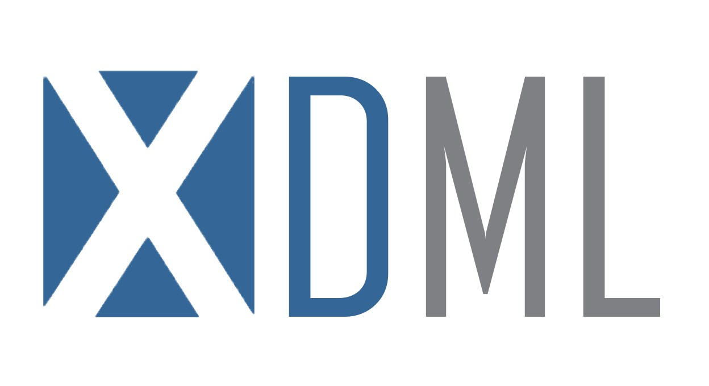
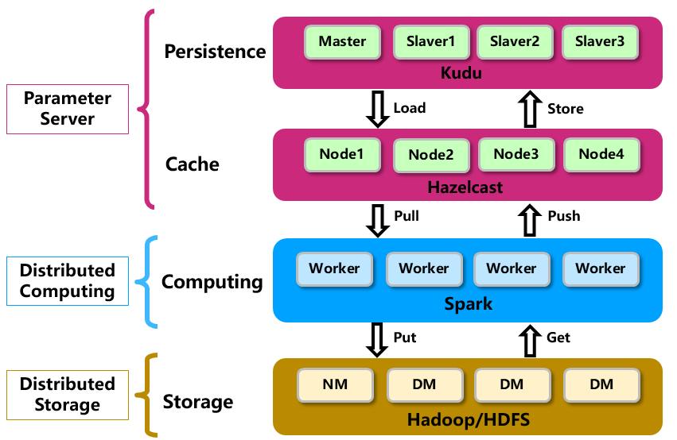

<br>
<div>
  <a href="https://github.com/Qihoo360/XLearning-XDML">
    
  </a>
</div>
  
[](./LICENSE)
[]()
[]()


**XDML**是一款基于参数服务器（Parameter Server），采用专门缓存机制的分布式机器学习平台。
XDML内化了学界最新研究成果，在效果保持稳定的同时，能大幅加速收敛进程，显著提升模型与算法的性能。同时，XDML还对接了一些优秀的开源成果和360公司自研成果，站在巨人的肩膀上，博采众长。 XDML还兼容hadoop生态，提供更好的大数据框架使用体验，将开发者从繁杂的工作中解脱出来。XDML已经在360内部海量规模数据上进行了大量测试和调优，在大规模数据量和超高维特征的机器学习任务上，具有良好的稳定性，扩展性和兼容性。 

欢迎对机器学习或分布式有兴趣的同仁一起贡献代码，提交Issues或者Pull Requests。

## 架构设计


针对超大规模机器学习的场景，奇虎360开源了内部的超大规模机器学习计算框架XDML。XDML是一款基于参数服务器（Parameter Server），采用专门缓存机制的分布式机器学习平台。它在360内部海量规模数据上进行了测试和调优，在大规模数据量和超高维特征的机器学习任务上，具有良好的稳定性，扩展性和兼容性。

## 功能特性
#### 1.提供特征预处理/分析，离线训练，模型管理等功能模块
#### 2.实现常用的大规模数据量场景下的机器学习算法
#### 3.充分利用现有的成熟技术，保证整个框架的高效稳定
#### 4.完全兼容hadoop生态，和现有的大数据工具实现无缝对接，提升处理海量数据的能力
#### 5.在系统架构和算法层面实现深度的工程优化，在不损失精度的前提下，大幅提高性能


## 代码结构

### 1.ps  
XDML的核心参数服务器架构，包括以下组件： 
 
 - [PS](./doc/PS.md)
 - [PSClient](./doc/PSClient.md)

### 2.conf
XDML的配置包，包括对参数服务器的配置和对作业及模型相关的配置。包括以下组件：

 - [JobConfiguration](./doc/JobConfigure.md)
 - [PSConfiguration](./doc/PSConfiguration.md)
 - ...

### 3.task
XDML向PS提交的作业，包括拉取和推送。包括以下任务：

 - Task
 - PullTask
 - PushTask

### 4.optimization
XDML模型的优化算法包。包括以下优化算法：

 - [BinaryClassify](./doc/BinaryClassify.md)
 - [FFM](./doc/FFMProcessor.md)
 - ...

### 5.ml
XDML中已经实现的部分机器学习模型。包括以下模型：

 - [LogisticRegression](./doc/LogisticRegression.md)
 - [LogisticRegressionWithDCASGD](./doc/LogisticRegressionWithDCASGD.md)
 - [LogisticRegressionWithFTRL](./doc/LogisticRegressionWithFTRL.md)
 - [LogisticRegressionWithMomentum](./doc/LogisticRegressionWithMomentum.md)
 - [FieldwareFactorizationMachine](./doc/FieldawareFactorizationMachine.md)
 - ...

### 6.feature
XDML中特征分析和特征处理模块。

- [特征分析](./doc/FeatureAnalysis.md)

  	特征分析覆盖常见的分析指标，如数值型特征的偏度、峰度、分位数，与label相关的auc、ndcg、互信息、相关系数等指标。

- [特征处理](./doc/FeatureProcess.md)
	
	特征处理覆盖常见的数值型、类别型特征预处理方法。包括以下算子：
	- CategoryEncoder
	- MultiCategoryEncoder
	- NumericBuckter
	- NumericStandardizer

### 7.model
XDML中包含用南京大学李武军老师提出的[Scope](https://arxiv.org/pdf/1602.00133.pdf)优化算法进行训练的线性模型，以及部分[H2O](https://www.h2o.ai/)模型的spark pipeline封装。具体包括以下模型：

[Model：](./doc/Model.md)

 - LinearScope
 - MultiLinearScope
 - OVRLinearScope
 - H2ODRF
 - H2OGBM
 - H2OGLM
 - H2OMLP

### 8.example
XDML中作业提交实例，可以参考[Example](./doc/Example.md).

## 编译&部署指南

XDML是基于Kudu、HazelCast以及Hadoop生态圈的一款基于参数服务器的，采用专门缓存机制的分布式机器学习平台。

### 环境依赖
- centos >= 7
- Jdk >= 1.8
- Maven >= 3.5.4
- scala >= 2.11
- hadoop >= 2.7.3
- spark >= 2.3.0
- sparkling-water-core >= 2.3.0
- kudu >= 1.9
- HazelCast >= 3.9.3

### Kudu安装部署
XDML基于Kudu，请首先部署Kudu。Kudu的安装部署请参考[Kudu](https://github.com/apache/kudu/tree/1.7.0)。

### 源码下载 
```git clone https://github.com/Qihoo360/XLearning-XDML```

### 编译
```mvn clean package -Dmaven.test.skip=true```
编译完成后，在源码根目录的`target`目录下会生成：`xdml-1.0.jar`、`xdml-1.0-jar-with-dependencies.jar`等多个文件，`xdml-1.0.jar`为未加spark、kudu等第三方依赖，`xdml-1.0-jar-with-dependencies.jar`添加了spark、kudu等依赖包。

## 运行示例

### 提交参数 
* **算法参数**  
   * spark.xdml.learningRate：学习率  
* **训练参数**  
   * spark.xdml.job.type：作业类型  
   * spark.xdml.train.data.path：训练数据路径  
   * spark.xdml.train.data.partitionNum：训练数据分区    
   * spark.xdml.model.path：模型存储路径  
   * spark.xdml.train.iter：训练迭代次数  
   * spark.xdml.train.batchsize：训练数据batch大小  
* **PS相关参数**  
   * spark.xdml.hz.clusterNum：hazelcast集群机器数目  
   * spark.xdml.table.name：kudu表名称  

### 提交命令    
可以通过以下命令提交示例训练作业：  

```    
  $SPARK_HOME/bin/spark-submit \   
    --master yarn-cluster \    
    --class net.qihoo.xitong.xdml.example.LRTest \   
    --num-executors 50 \   
    --executor-memory 40g \   
    --executor-cores 2 \   
    --driver-memory 4g \   
    --conf "spark.xdml.table.name=lrtest" \   
    --conf "spark.xdml.job.type=train" \   
    --conf "spark.xdml.train.data.path=$trainpath" \   
    --conf "spark.xdml.train.data.partitionNum=50" \   
    --conf "spark.xdml.hz.clusterNum=50" \   
    --conf "spark.xdml.model.path=$modelpath" \   
    --conf "spark.xdml.train.iter=5" \   
    --conf "spark.xdml.train.batchsize=10000" \   
    --conf "spark.xdml.learningRate=0.1" \   
    --jars xdml-1.0-jar-with-dependencies.jar \   
    xdml-1.0-jar-with-dependencies.jar   

```

注：提交命令中的设置有`$SPARK_HOME`、`$trainpath`、`$modelpath` 分别代表spark客户端路径、训练数据HDFS路径、模型存储HDFS路径  

## FAQ
[**XDML常见问题**](./doc/faq_cn.md)

## 参考文献
XDML参考了学界及工业界诸多优秀成果，对此表示感谢！

- Shen-Yi Zhao, Ru Xiang, Ying-Hao Shi, Peng Gao, Wu-Jun Li, [SCOPE: Scalable Composite Optimization for Learning on Spark](https://arxiv.org/pdf/1602.00133.pdf). AAAI 2017: 2928-2934.
- Shen-Yi Zhao, Gong-Duo Zhang, Ming-Wei Li, Wu-Jun Li.[Proximal SCOPE for Distributed Sparse Learning](https://arxiv.org/pdf/1803.05621.pdf).Proceedings of the Annual Conference on Neural Information Processing Systems (NIPS), 2018.
- Shuxin Zheng, Qi Meng, Taifeng Wang, Wei Chen, Zhi-Ming Ma and Tie-Yan Liu, [Asynchronous Stochastic Gradient Descent with Delay Compensation](https://arxiv.org/pdf/1609.08326.pdf), ICML 2017.

## 联系我们

Mail： <g-xlearning-dev@360.cn>     
QQ群：874050710  
